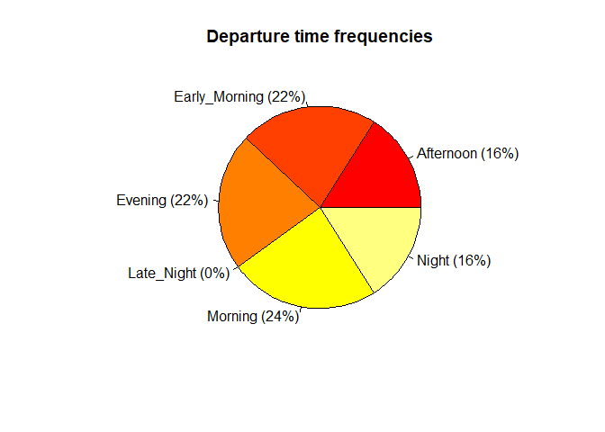
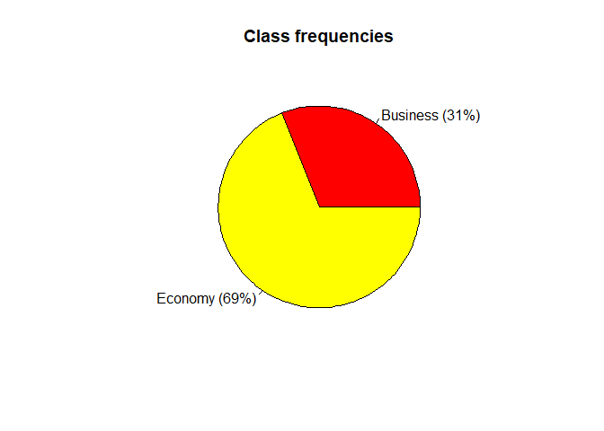
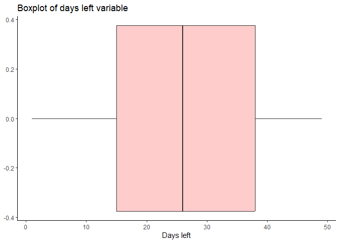
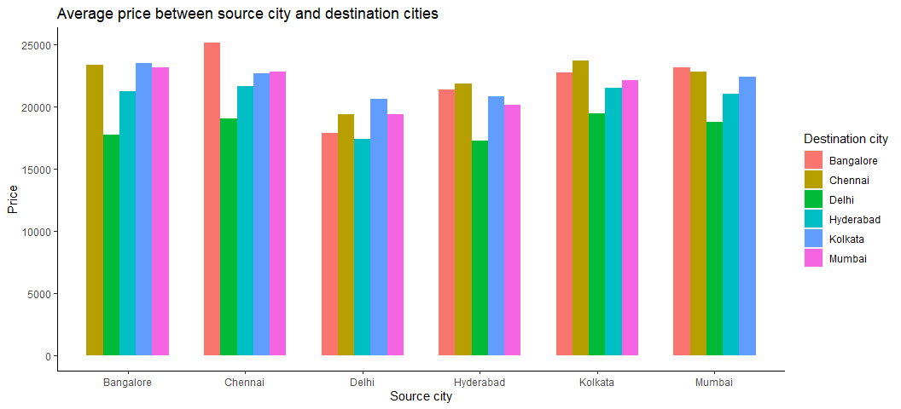

Flight price prediction
================
David Alexander Moe
2023-02-21

### Introduction

The objective of the study is to analyse the flight booking dataset
obtained from “Ease My Trip” website and to conduct various statistical
hypothesis tests in order to get meaningful information from it. The
‘Linear Regression’ statistical algorithm would be used to train the
dataset and predict a continuous target variable. ‘Easemytrip’ is an
internet platform for booking flight tickets, and hence a platform that
potential passengers use to buy tickets. A thorough study of the data
will aid in the discovery of valuable insights that will be of enormous
value to passengers.

### Research Questions:

The aim of our study is to answer the below research questions:

1)  Does price vary with Airlines?

2)  How is the price affected when tickets are bought in just 1 or 2
    days before departure?

3)  Does ticket price change based on the departure time and arrival
    time?

4)  How the price changes with change in Source and Destination?

5)  How does the ticket price vary between Economy and Business class?

### Dataset

Dataset contains information about flight booking options from the
website Easemytrip for flight travel between India’s top 6 metro cities.
There are 300261 datapoints and 11 features in the cleaned dataset.

### Features

The various features of the cleaned dataset are explained below:

1)  Airline: The name of the airline company is stored in the airline
    column. It is a categorical feature having 6 different airlines.

2)  Flight: Flight stores information regarding the plane’s flight code.
    It is a categorical feature.

3)  Source City: City from which the flight takes off. It is a
    categorical feature having 6 unique cities.

4)  Departure Time: This is a derived categorical feature obtained
    created by grouping time periods into bins. It stores information
    about the departure time and have 6 unique time labels.

5)  Stops: A categorical feature with 3 distinct values that stores the
    number of stops between the source and destination cities.

6)  Arrival Time: This is a derived categorical feature created by
    grouping time intervals into bins. It has six distinct time labels
    and keeps information about the arrival time.

7)  Destination City: City where the flight will land. It is a
    categorical feature having 6 unique cities.

8)  Class: A categorical feature that contains information on seat
    class; it has two distinct values: Business and Economy.

9)  Duration: A continuous feature that displays the overall amount of
    time it takes to travel between cities in hours.

10) Days Left: This is a derived characteristic that is calculated by
    subtracting the trip date by the booking date.

11) Price: Target variable stores information of the ticket price.

### Libraries used

``` r
library(dplyr)
library(ggplot2)
library(corrplot)
library(caret)
library(rpart)
library(rpart.plot)
library(nortest)
library(randomForest)
library(tidyverse)
require(gridExtra)
```

Setting the seed for reproducibility and importing the data:

``` r
set.seed(2023)
data <- read.csv("G:/Il mio Drive/MAGISTRALE/Data Analysis/GIT folder/Clean_Dataset.csv")
```

### Data inspection and intial preprocessing

``` r
#First look
str(data)
```

    ## 'data.frame':    300153 obs. of  12 variables:
    ##  $ X               : int  0 1 2 3 4 5 6 7 8 9 ...
    ##  $ airline         : chr  "SpiceJet" "SpiceJet" "AirAsia" "Vistara" ...
    ##  $ flight          : chr  "SG-8709" "SG-8157" "I5-764" "UK-995" ...
    ##  $ source_city     : chr  "Delhi" "Delhi" "Delhi" "Delhi" ...
    ##  $ departure_time  : chr  "Evening" "Early_Morning" "Early_Morning" "Morning" ...
    ##  $ stops           : chr  "zero" "zero" "zero" "zero" ...
    ##  $ arrival_time    : chr  "Night" "Morning" "Early_Morning" "Afternoon" ...
    ##  $ destination_city: chr  "Mumbai" "Mumbai" "Mumbai" "Mumbai" ...
    ##  $ class           : chr  "Economy" "Economy" "Economy" "Economy" ...
    ##  $ duration        : num  2.17 2.33 2.17 2.25 2.33 2.33 2.08 2.17 2.17 2.25 ...
    ##  $ days_left       : int  1 1 1 1 1 1 1 1 1 1 ...
    ##  $ price           : int  5953 5953 5956 5955 5955 5955 6060 6060 5954 5954 ...

``` r
data$X <- NULL

#Checking for rows with missing values
nrow(data)
```

    ## [1] 300153

``` r
data = na.omit(data)
nrow(data)
```

    ## [1] 300153

``` r
#checking for duplicates
sum(duplicated(data) == TRUE)
```

    ## [1] 0

``` r
#Changing wrong airlines names
data$airline <- gsub("Air_India", "Air India", data$airline)
data$airline <- gsub("GO_FIRST", "Go First", data$airline)
data$airline <- gsub("AirAsia", "Air Asia", data$airline)

attach(data) #For code simplicity
```

We note that there are no missing values and no duplicates. The dataset
is clean.

``` r
# quick look
head(data)
```

    ##    airline  flight source_city departure_time stops  arrival_time
    ## 1 SpiceJet SG-8709       Delhi        Evening  zero         Night
    ## 2 SpiceJet SG-8157       Delhi  Early_Morning  zero       Morning
    ## 3 Air Asia  I5-764       Delhi  Early_Morning  zero Early_Morning
    ## 4  Vistara  UK-995       Delhi        Morning  zero     Afternoon
    ## 5  Vistara  UK-963       Delhi        Morning  zero       Morning
    ## 6  Vistara  UK-945       Delhi        Morning  zero     Afternoon
    ##   destination_city   class duration days_left price
    ## 1           Mumbai Economy     2.17         1  5953
    ## 2           Mumbai Economy     2.33         1  5953
    ## 3           Mumbai Economy     2.17         1  5956
    ## 4           Mumbai Economy     2.25         1  5955
    ## 5           Mumbai Economy     2.33         1  5955
    ## 6           Mumbai Economy     2.33         1  5955

### EDA

### Categorical features

Distributions of source and destination cities:

``` r
#Creating frequency pie plot
#par(mfrow=c(1,2))
perc <- round(as.matrix(table(data$source_city))[1:length(table(data$source_city))]/nrow(data), 4)*100
name <- names(table(data$source_city))
name <- paste(name," (", perc, "%)", sep="")
pie(perc, labels = name, col=heat.colors(length(table(data$source_city))), main = "Source cities frequencies")
```

<!-- -->

``` r
#Creating frequency pie plot
perc <- round(as.matrix(table(data$destination_city))[1:length(table(data$destination_city))]/nrow(data), 4)*100
name <- names(table(data$destination_city))
name <- paste(name," (", perc, "%)", sep="")
pie(perc, labels = name, col=heat.colors(length(table(data$destination_city))), main = "Destination cities frequencies")
```

<!-- -->

``` r
#Creating frequency pie plot
par(mfrow=c(1,1))
perc <- round(as.matrix(table(data$airline))[1:length(table(data$airline))]/nrow(data), 2)*100
name <- names(table(data$airline))
name <- paste(name," (", perc, "%)", sep="")
pie(perc, labels = name, col=heat.colors(length(table(data$airline))), main = "Airlines frequencies")
```

<!-- -->

``` r
#Creating frequency pie plot
#par(mfrow=c(1,2))
perc <- round(as.matrix(table(data$departure_time))[1:length(table(data$departure_time))]/nrow(data), 2)*100
name <- names(table(data$departure_time))
name <- paste(name," (", perc, "%)", sep="")
pie(perc, labels = name, col=heat.colors(length(table(data$departure_time))), main = "Departure time frequencies")
```

<!-- -->

``` r
#Creating frequency pie plot
perc <- round(as.matrix(table(data$arrival_time))[1:length(table(data$arrival_time))]/nrow(data), 2)*100
name <- names(table(data$arrival_time))
name <- paste(name," (", perc, "%)", sep="")
pie(perc, labels = name, col=heat.colors(length(table(data$arrival_time))), main = "Arrival time frequencies")
```

<!-- -->

``` r
#Creating frequency pie plot
par(mfrow=c(1,1))
perc <- round(as.matrix(table(data$class))[1:length(table(data$class))]/nrow(data), 2)*100
name <- names(table(data$class))
name <- paste(name," (", perc, "%)", sep="")
pie(perc, labels = name, col=heat.colors(length(table(data$class))), main = "Class frequencies")
```

<!-- -->

### Numerical features

``` r
library(ggplot2)
#require(gridExtra)
p1 <- ggplot(data, aes(x=duration)) + 
  geom_boxplot(fill="#FF0000", alpha=0.2) +
  labs(x = "Duration", title = "Boxplot of duration variable")+
  theme(panel.grid.major = element_blank(), panel.grid.minor = element_blank(),
        panel.background = element_blank(), axis.line = element_line(colour = "black"))
p1
```

<!-- -->

``` r
p2 <- ggplot(data, aes(x=duration)) + 
  geom_histogram(aes(y=after_stat(density)),      # Histogram with density instead of count on y-axis
                 binwidth=.9,
                 colour="black", fill="white") +
  geom_density(alpha=.2, fill="#FF6666") + 
  labs(x = "Duration", y = "Density", title = "Distribution of duration variable")+
  theme(panel.grid.major = element_blank(), panel.grid.minor = element_blank(),
        panel.background = element_blank(), axis.line = element_line(colour = "black"))
p2
```

<!-- -->

``` r
#grid.arrange(p2, p1)
```

We can clearly notice three peaks in the histogram: we suspect that this
is due to the difference in duration according to the number of stops.
This is confirmed by looking at the next plot.

``` r
ggplot(data, aes(x = duration, y = stops, fill = stops)) + 
  geom_boxplot(fill="#FF6666", alpha=0.7) +
  scale_fill_brewer(palette = "Set1") +
  labs(title = "Boxplot of Duration by Number of Stops", x = "Duration", y = "Number of stops") +
  theme(panel.grid.major = element_blank(), panel.grid.minor = element_blank(),
        panel.background = element_blank(), axis.line = element_line(colour = "black"))
```

<!-- -->

``` r
#days left
p1 <- ggplot(data, aes(x=days_left)) + 
  geom_boxplot(fill="#FF0000", alpha=0.2) +
  labs(x = "Days left", title = "Boxplot of days left variable")+
  theme(panel.grid.major = element_blank(), panel.grid.minor = element_blank(),
        panel.background = element_blank(), axis.line = element_line(colour = "black"))
p1
```

<!-- -->

``` r
p2 <- ggplot(data, aes(x=days_left)) + 
  geom_histogram(aes(y=after_stat(density)),
                 binwidth=0.9,
                 colour="black", fill="white") +
  geom_density(alpha=.2, fill="#FF6666") + 
  labs(x = "Days left", y = "Density", title = "Distribution of days left variable")+
  theme(panel.grid.major = element_blank(), panel.grid.minor = element_blank(),
        panel.background = element_blank(), axis.line = element_line(colour = "black"))
#grid.arrange(p2, p1, ncol=2)
p2
```

<!-- -->

Now we look at the distribution of our target feature. We Scale it using
standardization to simplify computational calculation. The shape of the
distribution remains obviously the same as the non-scaled one.

``` r
#price (standardized because otherwise it would take too much time)
p1 <- ggplot(data, aes(x=(price-mean(price))/sd(price))) + 
  geom_boxplot(fill="#FF0000", alpha=0.2) +
  labs(x = "Price", title = "Boxplot of price variable")+
  theme(panel.grid.major = element_blank(), panel.grid.minor = element_blank(),
        panel.background = element_blank(), axis.line = element_line(colour = "black"))
p1
```

<!-- -->

``` r
p2 <- ggplot(data, aes(x=(price-mean(price))/sd(price))) + 
  geom_histogram(aes(y=after_stat(density)),
                 binwidth=.1,
                 colour="black", fill="white") +
  geom_density(alpha=.2, fill="#FF6666") +
  labs(x = "Price", y = "Density", title = "Distribution of price variable")+
  theme(panel.grid.major = element_blank(), panel.grid.minor = element_blank(),
                 panel.background = element_blank(), axis.line = element_line(colour = "black"))
p2
```

<!-- -->

Is possible to notice two peaks in the histogram: we suspect that one
peak derives from economy class tickets and the other derives from
business class tickets, which have a far higer price.

We proceed with plotting the average flight ticket price barplot.

``` r
#How does the ticket price vary between Economy and Business class?
input <- aggregate(price ~ class, data, mean)
ggplot(input, aes(x = class, y = price, fill = price)) +
  geom_bar(stat = "identity") +
  scale_fill_gradient(low = "#FF9999", high = "#FF5555") +
  labs(x = "Class", y = "Price", title = "Average price according to class") +
  theme(panel.grid.major = element_blank(), panel.grid.minor = element_blank(),
        panel.background = element_blank(), axis.line = element_line(colour = "black"))
```

<!-- -->

Does prices vary with airlines?

``` r
input <- aggregate(price ~ airline, data, mean)
ggplot(input, aes(x = price, y = airline, fill = price)) +
  geom_bar(stat = "identity") +
  scale_fill_gradient(low = "#FF9999", high = "#FF5555") +
  labs(x = "Average price", y = "Airline", title = "Average price of each airline") +
  theme(panel.grid.major = element_blank(), panel.grid.minor = element_blank(),
        panel.background = element_blank(), axis.line = element_line(colour = "black"))
```

<!-- -->

The answer is yes: price vary between airlines. But…

``` r
#mean prices according to class and airline
input <- aggregate(price ~ class + airline, data, mean)
ggplot(input, aes(x = airline, y = price, fill = class)) +
  geom_bar(stat = "identity", position="dodge", width=0.7) +
  labs(x = "Class", y = "Price", fill= "Class", title = "Average price of each airline according to class") +
  theme(panel.grid.major = element_blank(), panel.grid.minor = element_blank(),
        panel.background = element_blank(), axis.line = element_line(colour = "black"))
```

<!-- -->

``` r
#from this plot we note also that not all companies offer business class
#only vistara and air india offer business class
```

Does price vary according to the number of stops?

``` r
#Does the price vary according to the number of stops?
input <- aggregate(price ~ stops, data, mean)
ggplot(input, aes(x = price, y = stops, fill = price)) +
  geom_bar(stat = "identity") +
  scale_fill_gradient(low = "#FF9999", high = "#FF5555") +
  labs(x = "Average price", y = "Number of stops", title = "Average price of each airline") +
  theme(panel.grid.major = element_blank(), panel.grid.minor = element_blank(),
        panel.background = element_blank(), axis.line = element_line(colour = "black"))
```

<!-- -->

It seems that flights with two or more stops are cheaper than flights
with only one stop. This is not true because the percentage of business
tickets with two or more stops is much less than the tickets with one
stop. From the following boxplots we note that the higher is the number
of stops, the higher is the price, both for business and economy class.

``` r
#This is not true in fact:
p1 <- ggplot(data[data$class=="Economy",], aes(x = (price-mean(price))/sd(price) , y = stops, fill = stops)) + 
  geom_boxplot(fill="#FF0000", alpha=0.7) +
  scale_fill_brewer(palette = "Set1") +
  labs(title = "Price boxplots for Economy by number of Stops", x = "Standardized price", y = "Number of stops") +
  theme(panel.grid.major = element_blank(), panel.grid.minor = element_blank(),
        panel.background = element_blank(), axis.line = element_line(colour = "black")) + 
  coord_flip()
p1
```

<!-- -->

``` r
p2 <- ggplot(data[data$class=="Business",], aes(x = (price-mean(price))/sd(price) , y = stops, fill = stops)) + 
  geom_boxplot(fill="#FF0000", alpha=0.7) +
  scale_fill_brewer(palette = "Set1") +
  labs(title = "Price boxplots for Business by Number of Stops", x = "Standardized price", y = "Number of stops") +
  theme(panel.grid.major = element_blank(), panel.grid.minor = element_blank(),
        panel.background = element_blank(), axis.line = element_line(colour = "black")) +
  coord_flip()
p2
```

<!-- -->

How is the price affected when tickets are bought in just 1 or 2 days
before departure?

``` r
input <- aggregate(price ~ days_left, data, mean)
ggplot(input, aes(x = days_left, y = price, fill = price)) +
  geom_bar(stat = "identity") +
  scale_fill_gradient(low = "#FF9999", high = "#FF5555") +
  labs(x = "Days left", y = "Price", title = "Average price for days left until departure") +
  theme(panel.grid.major = element_blank(), panel.grid.minor = element_blank(),
        panel.background = element_blank(), axis.line = element_line(colour = "black")) +
  scale_x_discrete(limits=seq(1,49))
```


``` r
input <- aggregate(price ~ class + days_left, data, mean)
ggplot(input, aes(x = days_left, y = price, fill = class)) + 
  geom_bar(stat="identity", position="dodge", width=0.7) +
  labs(x = "Days left", y = "Price", fill="Class", title = "Average price for days left according to class") +
  theme(panel.grid.major = element_blank(), panel.grid.minor = element_blank(),
        panel.background = element_blank(), axis.line = element_line(colour = "black")) +
  scale_x_discrete(limits=seq(1,49))
```


We expect that the two plots have substantially the same shape but this
is not the case, especially in the first day bar. This is due to the
difference in percentages of Business and Economy ticket availability
between one day left until departure and the others. In particular the
percentages for one day left are 86% Economy and 14% Business tickets,
while the ones for two days left are 65% Economy and 25% Business
tickets available. The percentage of Economy tickets is much higher when
there is only one day left than when there are two or more days left
until departure. This implies that if we compute the mean of the
ticket’s price without looking at the class in the first day the result
is much lower than if we computed it for the other days. The conclusion
is that, in any case, buying the ticket (Economy or Business) one day
left until departure is not convenient: the first plot is useful to get
a preliminary idea but not essential to take decisions.

In fact:

``` r
x <- aggregate(class ~ days_left, data, length)
total_tikets <- x$class #total tickets available for each day left until departure

df_business <- data[data$class == "Business",]
x_business <- aggregate(df_business$class ~ df_business$days_left, data, length)
perc_business <- x_business$`df_business$class`/ x$class

df_economy <- data[data$class == "Economy",]
x_economy <- aggregate(df_economy$class ~ df_economy$days_left, data, length)
perc_economy <- x_economy$`df_economy$class`/ x$class

df <- cbind(x,perc_business,perc_economy)
names(df)[2] <- "total tickets"

ggplot(df, aes(x = days_left, y = perc_economy)) +
  geom_bar(stat = "identity", color="#FF9999") +
  labs(x = "Days left", y = "Economy ticket percentage availability", title = "Percentages of Economy tickets available according to days left") +
  theme(panel.grid.major = element_blank(), panel.grid.minor = element_blank(),
        panel.background = element_blank(), axis.line = element_line(colour = "black"))
```


Since we are working with percentages we show only the plot for the
Economy class tickets. We note that there is a different behavior in
terms of availability of tickets when you book one with only one day
left until departure.

Does ticket price change based on the departure time and arrival time?

``` r
input <- aggregate(price ~ departure_time, data, mean)
p1 <- ggplot(input, aes(x = departure_time, y = price, fill = price)) +
  geom_bar(stat = "identity") +
  scale_fill_gradient(low = "#FF9999", high = "#FF5555") +
  labs(x = "Departure time", y = "Price", title = "Average price according to departure times") +
  theme(panel.grid.major = element_blank(), panel.grid.minor = element_blank(),
        panel.background = element_blank(), axis.line = element_line(colour = "black"))
p1
```

<!-- -->

``` r
input <- aggregate(price ~ arrival_time, data, mean)
p2 <- ggplot(input, aes(x = arrival_time, y = price, fill = price)) +
  geom_bar(stat = "identity") +
  scale_fill_gradient(low = "#FF9999", high = "#FF5555") +
  labs(x = "Arrival time", y = "Price", title = "Average price according to arrival times") +
  theme(panel.grid.major = element_blank(), panel.grid.minor = element_blank(),
        panel.background = element_blank(), axis.line = element_line(colour = "black"))
p2
```

<!-- -->

How the price changes with change in Source and Destination?

``` r
#mean price from every source city to destination city
input <- aggregate(price ~ destination_city + source_city, data, mean)
ggplot(input, aes(x = source_city, y = price, fill = destination_city)) + 
  geom_bar(stat="identity", position="dodge", width=0.7) +
  labs(x = "Source city", y = "Price", fill="Destination city", title = "Average price between source city and destination cities") +
  theme(panel.grid.major = element_blank(), panel.grid.minor = element_blank(),
        panel.background = element_blank(), axis.line = element_line(colour = "black"))
```



## Correlation

``` r
library(corrplot)
```

    ## corrplot 0.92 loaded

``` r
corrplot.mixed(cor(data[,9:11]))
```

<!-- -->

There are no interesting correlations.

## Pre processing

``` r
df = data
# Deleting flights column which is useless for models
df$flight <- NULL
#head(df)

df$airline <- as.factor(df$airline)
df$source_city <- as.factor(df$source_city)
df$departure_time <- as.factor(df$departure_time)
df$stops <- as.factor(df$stops)
df$arrival_time <- as.factor(df$arrival_time)
df$destination_city <- as.factor(df$destination_city)
df$class <- as.factor(df$class)
str(df)
```

    ## 'data.frame':    300153 obs. of  10 variables:
    ##  $ airline         : Factor w/ 6 levels "Air Asia","Air India",..: 5 5 1 6 6 6 6 6 3 3 ...
    ##  $ source_city     : Factor w/ 6 levels "Bangalore","Chennai",..: 3 3 3 3 3 3 3 3 3 3 ...
    ##  $ departure_time  : Factor w/ 6 levels "Afternoon","Early_Morning",..: 3 2 2 5 5 5 5 1 2 1 ...
    ##  $ stops           : Factor w/ 3 levels "one","two_or_more",..: 3 3 3 3 3 3 3 3 3 3 ...
    ##  $ arrival_time    : Factor w/ 6 levels "Afternoon","Early_Morning",..: 6 5 2 1 5 1 5 3 5 3 ...
    ##  $ destination_city: Factor w/ 6 levels "Bangalore","Chennai",..: 6 6 6 6 6 6 6 6 6 6 ...
    ##  $ class           : Factor w/ 2 levels "Business","Economy": 2 2 2 2 2 2 2 2 2 2 ...
    ##  $ duration        : num  2.17 2.33 2.17 2.25 2.33 2.33 2.08 2.17 2.17 2.25 ...
    ##  $ days_left       : int  1 1 1 1 1 1 1 1 1 1 ...
    ##  $ price           : int  5953 5953 5956 5955 5955 5955 6060 6060 5954 5954 ...

``` r
library(corrplot)
library(caret)
```

    ## Caricamento del pacchetto richiesto: lattice

``` r
#Create dummies for each nominal feature
dummy <- dummyVars(" ~ .", data=df)
models_df <- data.frame(predict(dummy, newdata=df))

#Correlations of all features
#par(mar=c(3,3,3, 3))

corrplot(cor(models_df), number.cex = 0.4, tl.cex=0.5, tl.pos="l")
```

<!-- -->

We expect that from the variable importance point of view, the features
class and stops will have a big impact on the prediction of the future
prices

# Models

### Splitting in train and test sets for regression and decision trees

``` r
#Create index for train and test splittig
index <- sample(nrow(models_df), 0.8 * nrow(models_df))

#Split in train and test set for regression
df_train <- models_df[index,]
df_test <- models_df[-index,]
dim(df_train)
```

    ## [1] 240122     38

``` r
dim(df_test)
```

    ## [1] 60031    38

``` r
#Split in train and test for decision tree and random forest with same index
df_train_rf <- df[index,]
df_test_rf <- df[-index,]
dim(df_train_rf)
```

    ## [1] 240122     10

``` r
dim(df_test_rf)
```

    ## [1] 60031    10

### Scaling Data

``` r
#Scaling data function
#we use min max since the numerical features are always positive
min_max_scale <- function(x, range = c(0, 1)) {
  # Calculate min and max values of x
  x_min <- min(x, na.rm = TRUE)
  x_max <- max(x, na.rm = TRUE)
  # Scale x to the specified range
  (x - x_min) / (x_max - x_min) * (range[2] - range[1]) + range[1]
}

#Scaling days_left and duration
min_duration = min(df_train$duration)
max_duration = max(df_train$duration)
min_days = min(df_train$days_left)
max_days = max(df_train$days_left)

df_train$days_left <- min_max_scale(df_train$days_left)
df_train$duration <- min_max_scale(df_train$duration)

df_test$days_left <- (df_test$days_left - min_days)/(max_days - min_days)
df_test$duration <- (df_test$duration - min_duration)/(max_duration - min_duration)
```

### Error measures function

``` r
# Error measures function
error_measures <- function(y_true, y_pred, model_name = "Tree_Model") {
  r_squared <- cor(y_true, y_pred) ^ 2
  mse <- mean((y_true - y_pred) ^ 2)
  rmse <- sqrt(mse)
  mae <- mean(abs(y_true - y_pred))
  
  metrics_df <- data.frame(Model_Name = model_name,
                           R_Squared = r_squared, 
                           MSE = mse, 
                           RMSE = rmse, 
                           MAE = mae)
  return(metrics_df)
}
```

Now we proceed with the computation of the linear regression model

``` r
#Linear Model
m1 <- lm(price ~ ., data=df_train)

m2 <- lm(price ~ . -departure_time.Evening -departure_time.Late_Night -arrival_time.Late_Night, data=df_train)

anova(m1,m2)
```

    ## Analysis of Variance Table
    ## 
    ## Model 1: price ~ airline.Air.Asia + airline.Air.India + airline.Go.First + 
    ##     airline.Indigo + airline.SpiceJet + airline.Vistara + source_city.Bangalore + 
    ##     source_city.Chennai + source_city.Delhi + source_city.Hyderabad + 
    ##     source_city.Kolkata + source_city.Mumbai + departure_time.Afternoon + 
    ##     departure_time.Early_Morning + departure_time.Evening + departure_time.Late_Night + 
    ##     departure_time.Morning + departure_time.Night + stops.one + 
    ##     stops.two_or_more + stops.zero + arrival_time.Afternoon + 
    ##     arrival_time.Early_Morning + arrival_time.Evening + arrival_time.Late_Night + 
    ##     arrival_time.Morning + arrival_time.Night + destination_city.Bangalore + 
    ##     destination_city.Chennai + destination_city.Delhi + destination_city.Hyderabad + 
    ##     destination_city.Kolkata + destination_city.Mumbai + class.Business + 
    ##     class.Economy + duration + days_left
    ## Model 2: price ~ (airline.Air.Asia + airline.Air.India + airline.Go.First + 
    ##     airline.Indigo + airline.SpiceJet + airline.Vistara + source_city.Bangalore + 
    ##     source_city.Chennai + source_city.Delhi + source_city.Hyderabad + 
    ##     source_city.Kolkata + source_city.Mumbai + departure_time.Afternoon + 
    ##     departure_time.Early_Morning + departure_time.Evening + departure_time.Late_Night + 
    ##     departure_time.Morning + departure_time.Night + stops.one + 
    ##     stops.two_or_more + stops.zero + arrival_time.Afternoon + 
    ##     arrival_time.Early_Morning + arrival_time.Evening + arrival_time.Late_Night + 
    ##     arrival_time.Morning + arrival_time.Night + destination_city.Bangalore + 
    ##     destination_city.Chennai + destination_city.Delhi + destination_city.Hyderabad + 
    ##     destination_city.Kolkata + destination_city.Mumbai + class.Business + 
    ##     class.Economy + duration + days_left) - departure_time.Evening - 
    ##     departure_time.Late_Night - arrival_time.Late_Night
    ##   Res.Df        RSS Df  Sum of Sq      F    Pr(>F)    
    ## 1 240091 1.0934e+13                                   
    ## 2 240092 1.0936e+13 -1 -1.244e+09 27.316 1.729e-07 ***
    ## ---
    ## Signif. codes:  0 '***' 0.001 '**' 0.01 '*' 0.05 '.' 0.1 ' ' 1

We choose m2 as our final general model after the anova for nested
models test.

### Residuals analysis

``` r
r1 <- ggplot(data = data.frame(residuals(m2)), aes(x = residuals(m2))) + 
  geom_histogram(binwidth = 1, color = "#FF8888") + 
  xlab("Residuals") + ylab("Frequency") + 
  ggtitle("Residuals histogram for the linear model") +
  theme(panel.grid.major = element_blank(), panel.grid.minor = element_blank(),
        panel.background = element_blank(), axis.line = element_line(colour = "black"))
r1
```

<!-- -->

``` r
r2 <- ggplot(data = data.frame(residuals(m2)), aes(sample = residuals(m2))) + 
  stat_qq() + 
  stat_qq_line(colour="#FF6666") + 
  xlab("Theoretical Quantiles") + ylab("Sample Quantiles") + 
  ggtitle("QQ Plot of Residuals") +
  theme(panel.grid.major = element_blank(), panel.grid.minor = element_blank(),
        panel.background = element_blank(), axis.line = element_line(colour = "black"))
r2
```

<!-- -->

The tails are fatter than what you would see from a true normal. In
other words those points are much further from the mean than you would
expect if the data generating process were actually a normal
distribution. Also by looking at the histogram we would say that our
residuals are more likely to follow a t-student distribution rather than
a normal.

``` r
library(nortest)
ad.test(residuals(m2)) #H1: log(L) ~ N
```

    ## 
    ##  Anderson-Darling normality test
    ## 
    ## data:  residuals(m2)
    ## A = 4922.7, p-value < 2.2e-16

Obviously the normality of the residuals is rejected.

### Testing model

``` r
predicted_m2 <- predict(m2, newdata = df_test)
```

    ## Warning in predict.lm(m2, newdata = df_test): previsione da una stima non a
    ## rango pieno può essere non corretta

``` r
err_m1 <- error_measures(df_test$price, predicted_m2, model_name = "Linear regression: all features ")
```

Since the Vistara airline company is the one that offers most flights
among the airlines we chose to build 6 different models according to
class and number of stops:

- 3 model for economy class

- 3 for business class

First of all we need six different train dataframes (one for each
model):

``` r
df_economy = df[df$class=="Economy", ]
df_business = df[df$class=="Business", ]
df_economy$class <- NULL
df_business$class <- NULL

df_economy_vistara = df_economy[df_economy$airline=="Vistara", ]
df_business_vistara = df_business[df_business$airline=="Vistara", ]
df_economy_vistara$airline <- NULL
df_business_vistara$airline <- NULL

df_business_vistara_zero = df_business_vistara[df_business_vistara$stops=="zero", ]
df_business_vistara_one = df_business_vistara[df_business_vistara$stops=="one", ]
df_business_vistara_two = df_business_vistara[df_business_vistara$stops=="two_or_more", ]
df_economy_vistara_zero = df_economy_vistara[df_economy_vistara$stops=="zero", ]
df_economy_vistara_one = df_economy_vistara[df_economy_vistara$stops=="one", ]
df_economy_vistara_two = df_economy_vistara[df_economy_vistara$stops=="two_or_more", ]
df_business_vistara_zero$stops <- NULL
df_business_vistara_one$stops <- NULL
df_business_vistara_two$stops <- NULL
df_economy_vistara_zero$stops <- NULL
df_economy_vistara_one$stops <- NULL
df_economy_vistara_two$stops <- NULL
```

With the following code we train and validate our first linear model on
its dedicated dedicated train and test sets for the subset of Vistara
economy tickets with zero stop. We did the same procedures for each of
the subsets created before. We will omit the code.

``` r
#Model 1
#Economy zero_stops
#Splitting in train and test set
index_train <- sample(nrow(df_economy_vistara_zero), 0.8 * nrow(df_economy_vistara_zero))

df_model <- df_economy_vistara_zero[index_train, ]
df_test_model <- df_economy_vistara_zero[-index_train, ]

#Scaling days_left and duration
min_duration = min(df_model$duration)
max_duration = max(df_model$duration)
min_days = min(df_model$days_left)
max_days = max(df_model$days_left)

df_model$days_left <- min_max_scale(df_model$days_left)
df_model$duration <- min_max_scale(df_model$duration)

df_test_model$days_left <- (df_test_model$days_left - min_days)/(max_days - min_days)
df_test_model$duration <- (df_test_model$duration - min_duration)/(max_duration - min_duration)


#Create dummies for each categorical feature
dummy <- dummyVars(" ~ .", data=df_model)
models_df <- data.frame(predict(dummy, newdata=df_model))

dummy <- dummyVars(" ~ .", data=df_test_model)
df_test_model <- data.frame(predict(dummy, newdata=df_test_model))

#Creating model
lm1 <- lm(price ~ ., data=models_df)
summary(lm1)
```

    ## 
    ## Call:
    ## lm(formula = price ~ ., data = models_df)
    ## 
    ## Residuals:
    ##     Min      1Q  Median      3Q     Max 
    ## -3291.2  -934.8    42.7   793.0 12449.1 
    ## 
    ## Coefficients: (5 not defined because of singularities)
    ##                              Estimate Std. Error t value Pr(>|t|)    
    ## (Intercept)                   3963.97     107.88  36.745  < 2e-16 ***
    ## source_city.Bangalore          458.04      77.32   5.924 3.39e-09 ***
    ## source_city.Chennai            126.31     102.42   1.233  0.21755    
    ## source_city.Delhi             -333.66      76.72  -4.349 1.40e-05 ***
    ## source_city.Hyderabad          611.69      88.19   6.936 4.64e-12 ***
    ## source_city.Kolkata           1242.41      99.72  12.459  < 2e-16 ***
    ## source_city.Mumbai                 NA         NA      NA       NA    
    ## departure_time.Afternoon       -55.59     123.90  -0.449  0.65368    
    ## departure_time.Early_Morning  -223.56     202.73  -1.103  0.27020    
    ## departure_time.Evening          52.25      76.41   0.684  0.49412    
    ## departure_time.Late_Night          NA         NA      NA       NA    
    ## departure_time.Morning         -65.61     181.79  -0.361  0.71819    
    ## departure_time.Night               NA         NA      NA       NA    
    ## arrival_time.Afternoon          53.33     157.79   0.338  0.73539    
    ## arrival_time.Early_Morning     330.06     238.64   1.383  0.16671    
    ## arrival_time.Evening            51.82      88.34   0.587  0.55754    
    ## arrival_time.Late_Night       -339.81     178.28  -1.906  0.05671 .  
    ## arrival_time.Morning           221.41     187.20   1.183  0.23699    
    ## arrival_time.Night                 NA         NA      NA       NA    
    ## destination_city.Bangalore     224.97      76.06   2.958  0.00312 ** 
    ## destination_city.Chennai      -217.47     101.50  -2.142  0.03221 *  
    ## destination_city.Delhi        -378.04      78.36  -4.824 1.46e-06 ***
    ## destination_city.Hyderabad     211.36      85.97   2.459  0.01399 *  
    ## destination_city.Kolkata      1354.72     101.03  13.410  < 2e-16 ***
    ## destination_city.Mumbai            NA         NA      NA       NA    
    ## duration                      3680.60     151.29  24.328  < 2e-16 ***
    ## days_left                    -4523.53      72.49 -62.402  < 2e-16 ***
    ## ---
    ## Signif. codes:  0 '***' 0.001 '**' 0.01 '*' 0.05 '.' 0.1 ' ' 1
    ## 
    ## Residual standard error: 1346 on 4175 degrees of freedom
    ## Multiple R-squared:  0.5799, Adjusted R-squared:  0.5778 
    ## F-statistic: 274.5 on 21 and 4175 DF,  p-value: < 2.2e-16

``` r
#Prediction on test set
prediction = predict(lm1, newdata = df_test_model)
true_data = df_test_model$price

err_m2 <- error_measures(true_data, prediction, model_name = "Linear regression: Economy class - zero stops ")
```

``` r
#Model 2
#Economy one_stops
#splitting in train and test set
index_train <- sample(nrow(df_economy_vistara_one), 0.8 * nrow(df_economy_vistara_one))

df_model <- df_economy_vistara_one[index_train, ]
df_test_model <- df_economy_vistara_one[-index_train, ]

#Scaling days_left and duration
min_duration = min(df_model$duration)
max_duration = max(df_model$duration)
min_days = min(df_model$days_left)
max_days = max(df_model$days_left)
df_model$days_left <- min_max_scale(df_model$days_left)
df_model$duration <- min_max_scale(df_model$duration)

df_test_model$days_left <- (df_test_model$days_left - min_days)/(max_days - min_days)
df_test_model$duration <- (df_test_model$duration - min_duration)/(max_duration - min_duration)


#Create dummies for each categorical feature
dummy <- dummyVars(" ~ .", data=df_model)
models_df <- data.frame(predict(dummy, newdata=df_model))

dummy <- dummyVars(" ~ .", data=df_test_model)
df_test_model <- data.frame(predict(dummy, newdata=df_test_model))

#Creating model

lm2 <- lm(price ~ ., data=models_df)
#summary(lm2)

#Prediction on test set
prediction = predict(lm2, newdata = df_test_model)
true_data = df_test_model$price

err_m3 <- error_measures(true_data, prediction, model_name = "Linear regression: Economy class - one stop ")
#err_m3


#Model 3
#Economy two_stops
#splitting in train and test set
index_train <- sample(nrow(df_economy_vistara_two), 0.8 * nrow(df_economy_vistara_two))

df_model <- df_economy_vistara_two[index_train, ]
df_test_model <- df_economy_vistara_two[-index_train, ]

#Scaling days_left and duration
min_duration = min(df_model$duration)
max_duration = max(df_model$duration)
min_days = min(df_model$days_left)
max_days = max(df_model$days_left)
df_model$days_left <- min_max_scale(df_model$days_left)
df_model$duration <- min_max_scale(df_model$duration)

df_test_model$days_left <- (df_test_model$days_left - min_days)/(max_days - min_days)
df_test_model$duration <- (df_test_model$duration - min_duration)/(max_duration - min_duration)


#Create dummies for each categorical feature
dummy <- dummyVars(" ~ .", data=df_model)
models_df <- data.frame(predict(dummy, newdata=df_model))

dummy <- dummyVars(" ~ .", data=df_test_model)
df_test_model <- data.frame(predict(dummy, newdata=df_test_model))

#Creating model

lm3 <- lm(price ~ ., data=models_df)
#summary(lm3)

#Prediction on test set
prediction = predict(lm3, newdata = df_test_model)
prediction_vector = as.data.frame(prediction)$prediction
true_data = df_test_model$price

err_m4 <- error_measures(true_data, prediction, model_name = "Linear regression: Economy class - two or more stops ")
#err_m4


#Model 4
#Business zero_stops
#splitting in train and test set
index_train <- sample(nrow(df_business_vistara_zero), 0.8 * nrow(df_business_vistara_zero))

df_model <- df_business_vistara_zero[index_train, ]
df_test_model <- df_business_vistara_zero[-index_train, ]

#Scaling days_left and duration
min_duration = min(df_model$duration)
max_duration = max(df_model$duration)
min_days = min(df_model$days_left)
max_days = max(df_model$days_left)
df_model$days_left <- min_max_scale(df_model$days_left)
df_model$duration <- min_max_scale(df_model$duration)

df_test_model$days_left <- (df_test_model$days_left - min_days)/(max_days - min_days)
df_test_model$duration <- (df_test_model$duration - min_duration)/(max_duration - min_duration)


#Create dummies for each categorical feature
dummy <- dummyVars(" ~ .", data=df_model)
models_df <- data.frame(predict(dummy, newdata=df_model))

dummy <- dummyVars(" ~ .", data=df_test_model)
df_test_model <- data.frame(predict(dummy, newdata=df_test_model))

#Creating model

lm4 <- lm(price ~ ., data=models_df)
#summary(lm4)

#Prediction on test set
prediction = predict(lm4, newdata = df_test_model)
true_data = df_test_model$price

err_m5 <- error_measures(true_data, prediction, model_name = "Linear regression: Business class - zero stops ")
#err_m5

#Model 5
#Business one_stops
#splitting in train and test set
index_train <- sample(nrow(df_business_vistara_one), 0.8 * nrow(df_business_vistara_one))

df_model <- df_business_vistara_one[index_train, ]
df_test_model <- df_business_vistara_one[-index_train, ]

#Scaling days_left and duration
min_duration = min(df_model$duration)
max_duration = max(df_model$duration)
min_days = min(df_model$days_left)
max_days = max(df_model$days_left)
df_model$days_left <- min_max_scale(df_model$days_left)
df_model$duration <- min_max_scale(df_model$duration)

df_test_model$days_left <- (df_test_model$days_left - min_days)/(max_days - min_days)
df_test_model$duration <- (df_test_model$duration - min_duration)/(max_duration - min_duration)


#Create dummies for each categorical feature
dummy <- dummyVars(" ~ .", data=df_model)
models_df <- data.frame(predict(dummy, newdata=df_model))

dummy <- dummyVars(" ~ .", data=df_test_model)
df_test_model <- data.frame(predict(dummy, newdata=df_test_model))

#Creating model

lm5 <- lm(price ~ ., data=models_df)
#summary(lm5)

#Prediction on test set
prediction = predict(lm5, newdata = df_test_model)
true_data = df_test_model$price

err_m6 <- error_measures(true_data, prediction, model_name = "Linear regression: Business class - one stop ")
#err_m6

#Model 6
#Business two_stops
#splitting in train and test set
index_train <- sample(nrow(df_business_vistara_two), 0.8 * nrow(df_business_vistara_two))

df_model <- df_business_vistara_two[index_train, ]
df_test_model <- df_business_vistara_two[-index_train, ]

#Scaling days_left and duration
min_duration = min(df_model$duration)
max_duration = max(df_model$duration)
min_days = min(df_model$days_left)
max_days = max(df_model$days_left)
df_model$days_left <- min_max_scale(df_model$days_left)
df_model$duration <- min_max_scale(df_model$duration)

df_test_model$days_left <- (df_test_model$days_left - min_days)/(max_days - min_days)
df_test_model$duration <- (df_test_model$duration - min_duration)/(max_duration - min_duration)


#Create dummies for each categorical feature
dummy <- dummyVars(" ~ .", data=df_model)
models_df <- data.frame(predict(dummy, newdata=df_model))

dummy <- dummyVars(" ~ .", data=df_test_model)
df_test_model <- data.frame(predict(dummy, newdata=df_test_model))

#Creating model

lm6 <- lm(price ~ ., data=models_df)
#summary(lm6)

#Prediction on test set
prediction = predict(lm6, newdata = df_test_model)
true_data = df_test_model$price

err_m7 <- error_measures(true_data, prediction, model_name = "Linear regression: Business class - two or more stops ")
#err_m7
```

### Decision trees and random forests

We will show three regression decision trees:

- A general decision tree with all the data

- A tree only for economy class

- A tree only for business class

``` r
library(rpart)
library(rpart.plot)

# First general model
df_dt <- rpart(price ~ ., data = df_train_rf, method="anova")
#summary(df_dt)
rpart.plot(df_dt, extra=101)
```

<!-- -->

``` r
prediction_dt <- predict(df_dt, newdata = df_test_rf, method="anova")
err_m8 <- error_measures(df_test_rf$price, prediction_dt, model_name = "Decision tree: all features ")
```

``` r
library(rpart)
library(rpart.plot)
# Economy class
df_dt_eco <- rpart(price ~ ., data = df_train_rf[df_train_rf$class=="Economy",], method="anova")
#summary(df_dt_eco)
rpart.plot(df_dt_eco, extra=101)
```

<!-- -->

``` r
prediction_dt <- predict(df_dt_eco, newdata = df_test_rf, method="anova")
err_m9 <- error_measures(df_test_rf$price, prediction_dt, model_name = "Decision tree: Economy class ")

# Business class
df_dt_bus <- rpart(price ~ ., data = df_train_rf[df_train_rf$class=="Business",], method="anova")
#summary(df_dt_bus)
rpart.plot(df_dt_bus, extra=101)
```

<!-- -->

``` r
prediction_dt <- predict(df_dt_bus, newdata = df_test_rf, method="anova")
err_m10 <- error_measures(df_test_rf$price, prediction_dt, model_name = "Decision tree: Business class ")
```

With the aim of improving the performances of the regression trees, we
run two random forests splitting by class, the most relevant feature in
terms of variable importance.

``` r
library(randomForest)
```

    ## randomForest 4.7-1.1

    ## Type rfNews() to see new features/changes/bug fixes.

    ## 
    ## Caricamento pacchetto: 'randomForest'

    ## Il seguente oggetto è mascherato da 'package:ggplot2':
    ## 
    ##     margin

``` r
library(tidyverse)
```

    ## ── Attaching core tidyverse packages ──────────────────────── tidyverse 2.0.0 ──
    ## ✔ dplyr     1.0.10     ✔ readr     2.1.4 
    ## ✔ forcats   1.0.0      ✔ stringr   1.5.0 
    ## ✔ lubridate 1.9.0      ✔ tibble    3.1.7 
    ## ✔ purrr     0.3.5      ✔ tidyr     1.2.1

    ## ── Conflicts ────────────────────────────────────────── tidyverse_conflicts() ──
    ## ✖ dplyr::combine()       masks randomForest::combine()
    ## ✖ dplyr::filter()        masks stats::filter()
    ## ✖ dplyr::lag()           masks stats::lag()
    ## ✖ purrr::lift()          masks caret::lift()
    ## ✖ randomForest::margin() masks ggplot2::margin()
    ## ℹ Use the ]8;;http://conflicted.r-lib.org/conflicted package]8;; to force all conflicts to become errors

``` r
library(dplyr)

#Economy
df_rf_eco <- randomForest(price ~ ., data = df_train_rf[df_train_rf$class=="Economy",], ntree = 10)
prediction_rf <- predict(df_rf_eco, df_test_rf)
varImpPlot(df_rf_eco, main = "Feature importance of Economy class random forest")
```

<!-- -->

``` r
err_m11 <- error_measures(df_test_rf$price, prediction_rf, model_name = "Random forest: Economy class ")

#Business
df_rf_bus <- randomForest(price ~ . -class, data = df_train_rf[df_train_rf$class=="Business",], ntree = 10)
prediction_rf <- predict(df_rf_bus, df_test_rf)
varImpPlot(df_rf_bus, main = "Feature importance of Business class random forest")
```

<!-- -->

``` r
err_m12 <- error_measures(df_test_rf$price, prediction_rf, model_name = "Random forest: Business class ")
```

## Conclusions

``` r
final_table <- rbind(err_m1, err_m2, err_m3, err_m4, err_m5, err_m6, err_m7, err_m8, err_m9, err_m10, err_m11, err_m12)
final_table
```

    ##                                                Model_Name  R_Squared        MSE
    ## 1                        Linear regression: all features  0.91115495   45937334
    ## 2          Linear regression: Economy class - zero stops  0.55634735    1925918
    ## 3            Linear regression: Economy class - one stop  0.49502648    6879520
    ## 4   Linear regression: Economy class - two or more stops  0.55453963    9013091
    ## 5         Linear regression: Business class - zero stops  0.56814491   23530520
    ## 6           Linear regression: Business class - one stop  0.20690947   93072324
    ## 7  Linear regression: Business class - two or more stops  0.33932911   73119650
    ## 8                            Decision tree: all features  0.91603705   43412860
    ## 9                           Decision tree: Economy class  0.06769841  691553063
    ## 10                         Decision tree: Business class  0.03389251 1483665496
    ## 11                          Random forest: Economy class  0.07655940  687451440
    ## 12                         Random forest: Business class  0.09662253 1353562693
    ##         RMSE       MAE
    ## 1   6777.709  4595.113
    ## 2   1387.774  1033.864
    ## 3   2622.884  1957.211
    ## 4   3002.181  2296.456
    ## 5   4850.827  3154.300
    ## 6   9647.400  7499.671
    ## 7   8551.003  6766.310
    ## 8   6588.844  4324.981
    ## 9  26297.397 15266.326
    ## 10 38518.379 32897.769
    ## 11 26219.295 14748.656
    ## 12 36790.796 30791.768

Looking at the final table we note that it was essential to split in
economy and business class tickets for linear regressions. Regarding the
linear models is important to underline that the R-squared is not the
only thing to look when validating the model. We note that decision
trees and random forests are working better if ran with all the features
with a much higher R-squared and much lower MSE.There surely are better
models to conduct the analysis.
